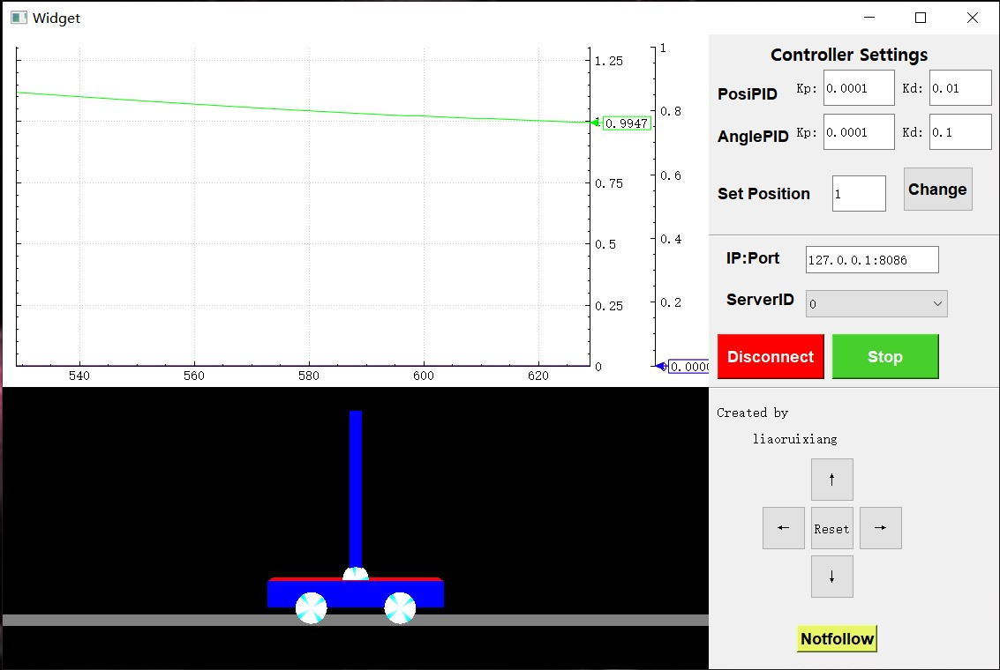
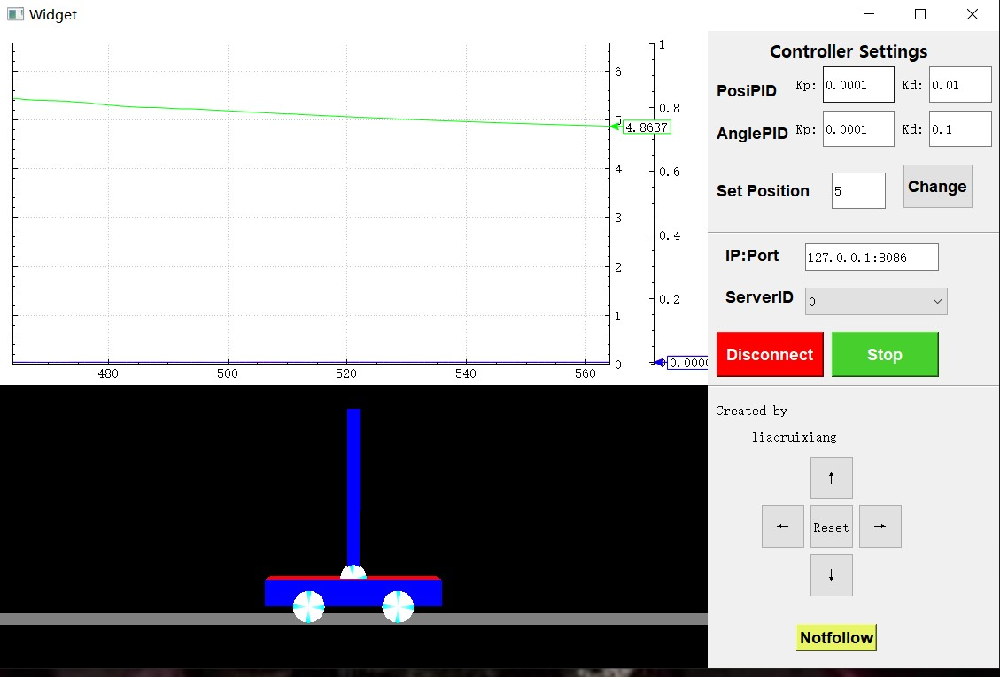
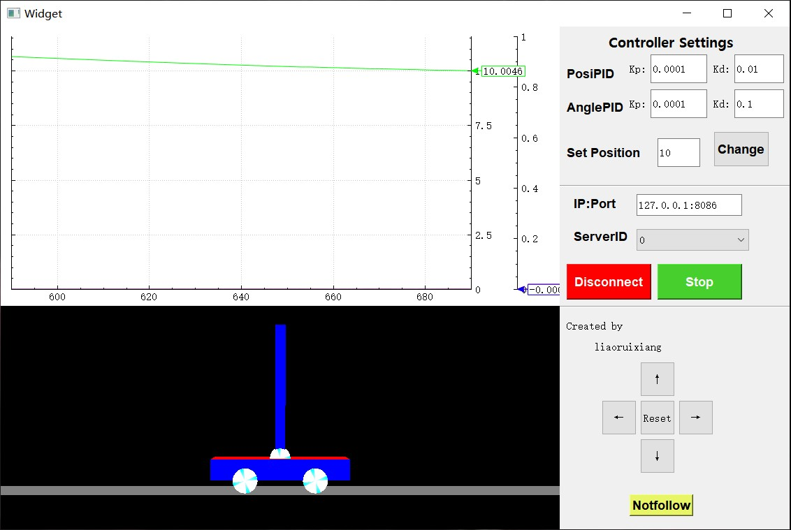
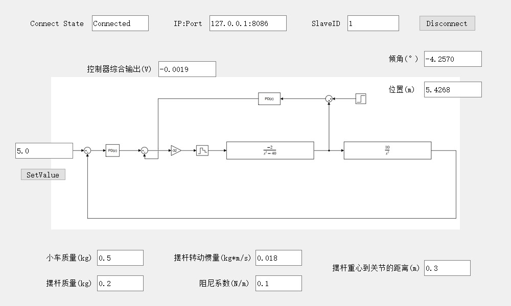

# 基于双闭环PID控制的一阶倒立摆系统设计

## 个人基本信息

- 作者：LiaoRuixiang、ChenChenglin、ZhongYupei、ChenYihao

- 项目名称：基于双闭环PID控制的一阶倒立摆系统设计

## 运行效果截图

将物理对象、控制器、通信过程、界面设计等环节进行整合后，得到的完整效果如下图所示。其中，界面右上方为内外环控制器参数调整模块；Start按钮表示启停控制；Connect按钮表示建立连接；红色曲线代表摆杆角度，绿色曲线代表小车位置，蓝色曲线代表控制量，且三条曲线均能附加实现数值显示；上下左右按钮代表从不同立体角度观测小车运动状态。

1. 控制器和监控程序演示效果如下图所示。

2. 模拟的被控对象程序演示效果如下图所示。

